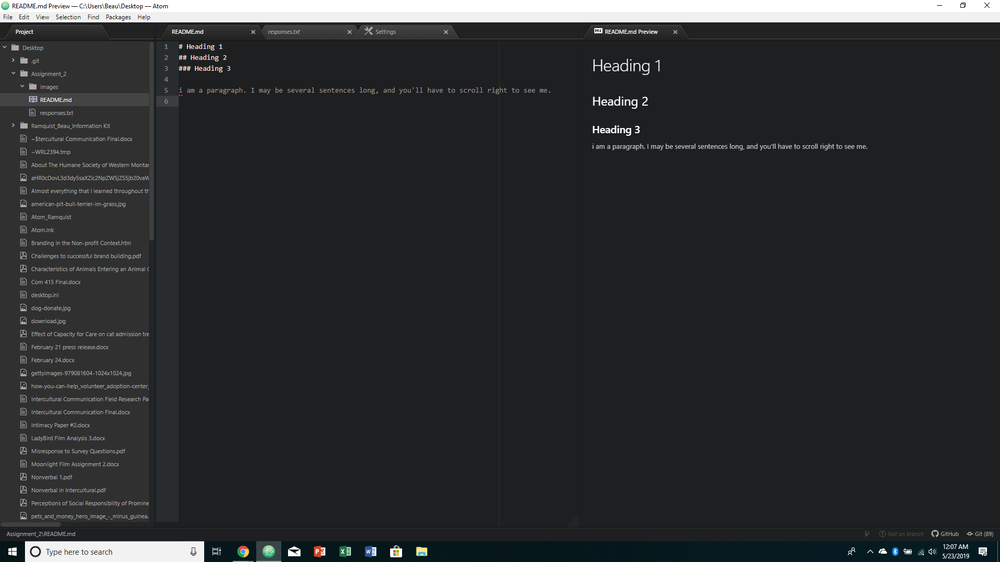

# Assignment 2
## Beau Ramquist
I decided to take this course because I really enjoy video editing and smartphone app design. I figured this course would help me become familiar with different editing software and all around more fluent on computers. My mom also called UM and the lady she spoke to highly recommended this class as it seemed students had really enjoyed this course.
I hope to be able to design my own website to my specific liking, learn more about how information is sent online, and also potentially construct a music streaming platform as my final project/personal project. 
https://www.twitch.tv/
[My Responses](./responses.txt)

