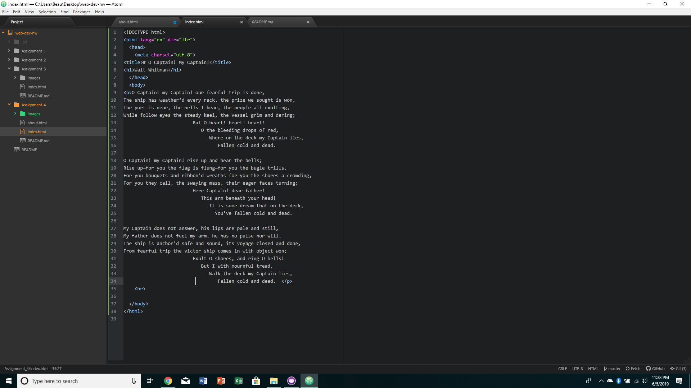

I visited ESPN.com with the wayback machine and was extremely fascinated by how this process works. I had no idea that this was even possible, it was so cool to look at old news stories of the dated superstars that used to be popular back in the day. Along with that, the websites were a lot less developed and didn't have many drop down menus, so the usability of the site was weaker.

I have learned a lot from this git module. I'm beginning to understand how the connection works between my desktop, Atom, and Github. I'm becoming more familiar with adding content to the 4 main document elements as well. Something I had trouble with is just interpreting the instructions the first few times, but with trial and error I can resolve most of my issues. 

